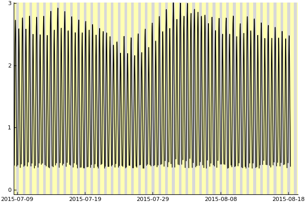
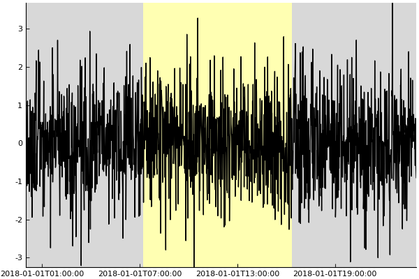

# DaylightPlots

Recipes for producing "daylight plots"



# Installation

This package is currently unregistered. To install

```julia
julia> Pkg.clone("https://github.com/wkearn/DaylightPlots.jl")
```

# Basic Usage

DaylightPlots exports a function `daylight`

```julia
julia> t = DateTime(2018,01,01):Minute(1):DateTime(2018,01,02)

julia> x = randn(length(t))

julia> daylight(t,x,loc=Point(42.35, -71.05),tz=tz"America/New_York")
```



The default implementation of `daylight` takes two arguments, a collection of `DateTime`s, `t`, and a collection of data, `x`. It also needs two keyword arguments. `loc` takes a `Point`, a type exported by DaylightPlots to represent geographic coordinates in latitude and longitude, and `tz` takes a `TimeZone` from the [TimeZones.jl](https://github.com/JuliaTime/TimeZones.jl) package (which is reexported from DaylightPlots for your use). `tz` should represent the time zone in which the times `t` are to be interpreted.

# Need help?

Feel free to [open an issue](https://github.com/wkearn/DaylightPlots.jl/issues/new) if something doesn't work the way you expected. I also try to hang around in the [Plots.jl gitter channel](https://gitter.im/tbreloff/Plots.jl) if you have a quick question. Just be sure to tag me, (@wkearn) so I get notified.

# User-defined types

It is possible to use `daylight` with user-defined types representing time series. It just needs to be able to calculate the range of the data in order to compute the daylight hours properly. DaylightPlots uses a function called `tlims` to do this calculation. `tlims` is given all of the arguments passed to the `daylight` function and returns three objects: a `Tuple{DateTime,DateTime}` that contains the start and end of the time series, and two numbers representing the extreme data values.  The default implementation of `tlims` is

```julia
function tlims(t,x)
    ts = extrema(t)
    a,b = extrema(x)
    ts,a,b
end
```

If we have a type `Foo` which contains a field `t::Vector{DateTime}` and `x::Vector{Float64}`, we would write the following code to enable daylight plots of objects of type `Foo`

```julia
struct Foo
    t::Vector{DateTime}
    x::Vector{Float64}
end

# This is the line that is needed to enable daylight plots
DaylightPlots.tlims(f::Foo) = DaylightPlots.tlims(f.t,f.x)

# Below is how you would go about plotting a Foo
t = DateTime(2018,01,01):Minute(1):DateTime(2018,01,02)

x = randn(length(t))

f = Foo(t,x)

daylight(f,loc=Point(42.35,-71.05),tz=tz"America/New_York")
```

# Want to contribute?

If you have a cool example of a daylight plot made with this package, feel free to add it to the `examples/` directory. Please include a script that produces the plot along with a PNG of the plot itself. It's okay if you don't want to include the data behind the plot, but if you can, and it's not too big, please do!

I've opened some issues with the [enhancement tag](https://github.com/wkearn/DaylightPlots.jl/issues?q=is%3Aissue+is%3Aopen+label%3Aenhancement) for ways in which I would like to improve DaylightPlots. Feel free to tackle any of those in a fork and open up a pull request. If you have any other ideas, please open an issue first, so we can discuss it before you spend a lot of time working on something that isn't really appropriate for DaylightPlots. I should say that I am more or less happy with the scope of this package. I really just want a way to produce these sorts of plots that is extensible to different sorts of time series data. I'm not really thinking about adding more features like different plot types. I could be convinced otherwise.

# Details on the daylight hours calculation

DaylightPlots uses a more or less direct port of the NOAA Earth System Research Laboratory solar calculator (https://www.esrl.noaa.gov/gmd/grad/solcalc/) to calculate the hours of sunrise and sunset.

While I have tested my implementation of the solar calculations (see [test/sunrise.jl](test/sunrise.jl)), I make no guarantees that these data are accurate and would not recommend using them for anything other than making daylight plots.

It is unlikely that the daylight hours calculation will work at locations above or below the Arctic and Antarctic circles.

Contributions to the solar calculator are welcome. I am unlikely to improve it further myself unless I have a pressing research need for more accurate or more robust daylight hours calculation.
